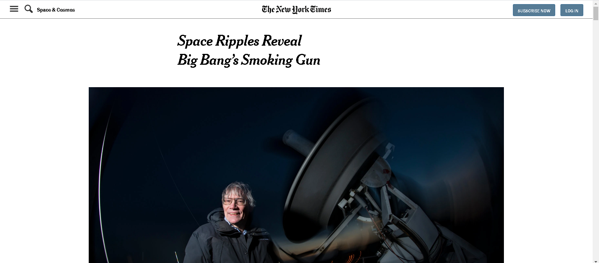

# Project Name

> NYT Clone.

This Is Clone of the new york times article.

## Built With

- HTML
- CSS

## Live Demo

[Live Demo Link](https://raw.githack.com/Spayco/NYT-Clone/master/index.html)

### Usage

- open index.html file

## Authors

👤 **SpaYco**

- Github: [@SpaYco](https://github.com/SpaYco)
- Twitter: [@iSpaYco](https://twitter.com/iSpaYco)
- Linkedin: [Aziz Mejri](https://www.linkedin.com/in/spayco/)

👤 **Kotoku Kennedy**

- Github: [@kotoku-code](https://github.com/kotoku-code)
- Twitter: [@kennedykotoku](https://twitter.com/kennedykotoku)
- Linkedin: [Kotoku Kennedy](www.linkedin.com/in/kotoku-kennedy-5b04a9128)

## 🤝 Contributing

Contributions, issues and feature requests are welcome!

Feel free to check the [issues page](issues/).

## Show your support

Give a ⭐️ if you like this project!
## 📝 License

This project is [MIT](LICENSE) licensed.
